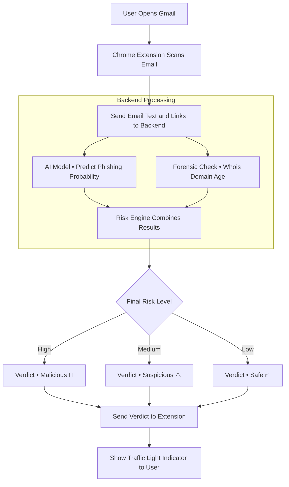
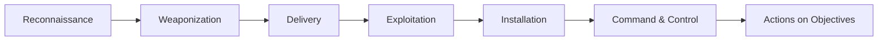
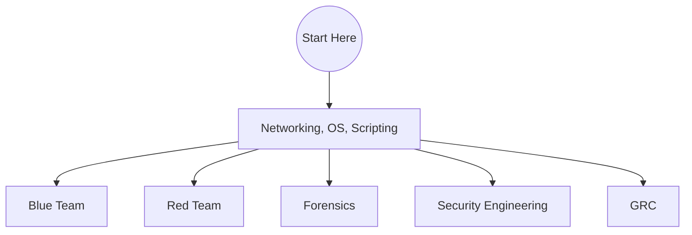

# 🛡️ The Zero-to-Hero Cybersecurity Handbook

**A structured, practical, zero-to-hero roadmap to learning Cybersecurity — the smart way.**

[Start Learning](#-phase-1-the-foundations) • [Career Map](#-career-navigator) • [Practice Labs](#-the-dojo-practice-platforms) • [Contribute](#-how-to-contribute)

---

# 🧭 Navigation
- [Phase 1: The Foundations](#-phase-1-the-foundations)
- [Phase 2: The Attack Lifecycle](#-phase-2-the-attack-lifecycle)
- [Phase 3: Defensive Engineering (Blue Team)](#️-phase-3-defensive-engineering-blue-team)
- [Phase 4: Offensive Operations (Red Team)](#️-phase-4-offensive-operations-red-team)
- [Phase 5: Advanced Domains](#-phase-5-advanced-domains)
  - [Cloud Security](#-cloud-security)
  - [Application Security (AppSec)](#-application-security-appsec)
- [Career Navigator](#-career-navigator)
- [Key Certifications](#-key-certifications)
- [The Toolbox](#-the-toolbox)
- [Project Library](#-project-library-build-to-learn)
- [The Dojo (Practice Platforms)](#-the-dojo-practice-platforms)
- [Further Learning & Resources](#-further-learning--resources)
- [Legal & Ethics](#-legal--ethics)
- [How to Contribute](#-how-to-contribute)

---

# 🧠 Phase 1: The Foundations

### 🔺 CIA Triad & Beyond

| Pillar | Meaning | Real-World Example |
|---|---|---|
| **Confidentiality** | Keeping data secret. | *An unauthorized employee accessing HR salary records.* |
| **Integrity** | Keeping data accurate and untampered. | *A threat actor altering a bank transaction amount.* |
| **Availability** | Ensuring systems and data are accessible. | *A DDoS attack taking a website offline during a product launch.* |
| **Authenticity** | Verifying that users and data are genuine. | *Using digital signatures to prove the origin of an email.* |
| **Non-Repudiation** | Ensuring no one can deny having sent a message. | *Blockchain transaction logs that cannot be altered.* |

### 🔐 AAA — Identity & Access Management (IAM)
- **Authentication** — Proving you are who you say you are. (e.g., Password, Biometrics, MFA)
- **Authorization** — What you are allowed to do. (e.g., User vs Admin permissions)
- **Accounting** — Recording what you did and when. (e.g., Audit logs)

---

# 🦠 Phase 2: The Attack Lifecycle

Understanding how attacks work is key to stopping them. The Cyber Kill Chain is a classic model.

🔻 Expand Breakdown

### 🛡️ Cyber Kill Chain Overview

| **Stage** | **Example** | **Defense** |
|---|---|---|
| **Reconnaissance** | OSINT, port scanning, social media analysis. | Minimize public footprint, firewall whitelisting. |
| **Weaponization** | Embedding a macro in a Word doc, creating a payload. | Not directly defensible; focus on later stages. |
| **Delivery** | Phishing emails, malicious USB drives, watering hole attacks. | Email security gateways, user training, network filtering. |
| **Exploitation** | Triggering a buffer overflow (CVE), tricking a user. | Vulnerability patching, access control, memory protection. |
| **Installation** | Installing a backdoor, scheduled task persistence. | EDR/XDR, file integrity monitoring, app whitelisting. |
| **Command & Control (C2)** | Beaconing to attacker infrastructure. | Egress filtering, DNS sinkholing. |
| **Actions on Objectives** | Data exfiltration, ransomware, lateral movement. | IR playbooks, backups, segmentation. |

---

# 🛡️ Phase 3: Defensive Engineering (Blue Team)

### 🏛 Frameworks & Models
- **NIST Cybersecurity Framework (CSF)** — Identify, Protect, Detect, Respond, Recover
- **MITRE ATT&CK** — Real-world adversary tactics & techniques
- **Zero Trust Architecture (ZTA)** — Never trust, always verify

### 🧰 The Modern Defensive Stack

| Layer | Tools | Purpose |
|---|---|---|
| **SIEM** | Wazuh, Splunk, QRadar, Elastic SIEM | Log aggregation & correlation |
| **EDR/XDR** | CrowdStrike, SentinelOne, Microsoft Defender | Endpoint protection & response |
| **SOAR** | Palo Alto XSOAR, Tines, Splunk SOAR | Response automation |
| **Firewall/NGFW** | Palo Alto, Fortinet, Cisco | Traffic filtering |
| **Threat Intel** | Recorded Future, Mandiant, VirusTotal | Threat awareness |

---

# ⚔️ Phase 4: Offensive Operations (Red Team)

| Assessment Type | Goal | Scope & Mindset |
|---|---|---|
| **Vulnerability Assessment** | Identify weaknesses | Broad & automated |
| **Penetration Test** | Prove real impact | Targeted & methodical |
| **Red Team Simulation** | Test detection & response | Stealthy & persistent |

---

# 🌐 Phase 5: Advanced Domains

### ☁️ Cloud Security
- **Shared Responsibility Model**
- **Identity & Access Management (IAM)**
- **CSPM** — Wiz, Prisma Cloud
- **CWPP** — Cloud workload protection

### 💻 Application Security (AppSec)
- **OWASP Top 10**
- **SAST** — SonarQube, Checkmarx
- **DAST** — OWASP ZAP, Burp Suite
- **SCA** — Snyk, Dependabot

---

# 🗺 Career Navigator

## 🏅 Key Certifications

| Certification | Issuer | Best For | Track |
|---|---|---|---|
| **CompTIA Security+** | CompTIA | Foundations | Entry |
| **CISSP** | (ISC)² | Leadership | GRC |
| **OSCP** | Offensive Security | Pentesting | Red |
| **GCIH** | GIAC | Incident Response | Blue |
| **eJPT** | INE | Junior Pentesting | Red |
| **CCSP** | (ISC)² | Cloud Security | Cloud |

---

## 🛠 The Toolbox

### 🐧 Operating Systems
- **Kali Linux**
- **Parrot OS**
- **Flare VM**
- **Security Onion**
- **Commando VM**

### 🔧 Essential Tools

| Category | Tools |
|---|---|
| **Recon** | Nmap, Masscan, ffuf, Gobuster |
| **Web** | Burp Suite, OWASP ZAP |
| **Cracking** | Hashcat, John, Hydra |
| **Network** | Wireshark, tcpdump |
| **Exploitation** | Metasploit, SQLMap |
| **Reverse Engineering** | Ghidra, IDA Pro |
| **Active Directory** | BloodHound, Mimikatz |

---

## 🏗 Project Library: Build to Learn

| Level | Project | Skills |
|---|---|---|
| **Beginner** | Python Port Scanner | Networking |
| **Beginner** | Log Parser | Regex, File I/O |
| **Intermediate** | SIEM Lab | Log Analysis |
| **Intermediate** | Malware Sandbox | RE Basics |
| **Intermediate** | CloudGoat | Cloud Hardening |
| **Advanced** | AD Pentest Lab | Lateral Movement |
| **Advanced** | Ransomware Decryptor | Cryptography & RE |

---

## 🥋 The Dojo: Practice Platforms

| Platform | Best For | Price |
|---|---|---|
| **TryHackMe** | Guided learning | Freemium |
| **Hack The Box** | Realistic labs | Freemium |
| **OverTheWire** | Fundamentals | Free |
| **Blue Team Labs** | SOC & DFIR | Freemium |
| **LetsDefend** | SOC training | Freemium |
| **PortSwigger Academy** | Web security | Free |

---

## 📚 Further Learning & Resources

### 📖 Essential Reading
- *The Phoenix Project*
- *Hacking: The Art of Exploitation*
- *Practical Malware Analysis*
- *The Cuckoo's Egg*

### 📰 Blogs & News
- Krebs on Security
- The Hacker News
- Dark Reading
- BleepingComputer

### 📺 YouTube
- The Cyber Mentor
- John Hammond
- Hak5
- IppSec

---

## 📜 Legal & Ethics

⚠️ **Unauthorized access is illegal.**  
Practice only on systems you **own** or have **explicit permission** to test.

---

## 📄 How to Contribute
- Fork the repository  
- Create a feature branch  
- Commit your changes  
- Push to your branch  
- Open a Pull Request  

---

⭐ **Star this repo if this guide helped you!** ⭐  
**Fork → Improve → Pull Request**

