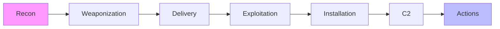

# 🛡️ The Zero-to-Hero Cybersecurity Handbook

<div align="center">


**A structured, practical, zero-to-hero roadmap to learning Cybersecurity — the smart way.**

[Start Learning](#-phase-1-the-foundations) • [Career Map](#-career-navigator) • [Practice Labs](#-the-dojo-practice-platforms)

</div>

---

# 📁 Repository Structure


---

# 🧭 Navigation  
- [Phase 1: Foundations](#-phase-1-the-foundations)  
- [Phase 2: Attack Lifecycle](#-phase-2-the-attack-lifecycle)  
- [Phase 3: Defensive Engineering](#-phase-3-defensive-engineering-blue-team)  
- [Phase 4: Offensive Operations](#️-phase-4-offensive-operations-red-team)  
- [Toolbox](#-the-toolbox-industry-standards)  
- [Project Library](#-project-library-build-to-learn)  
- [Practice Labs](#-the-dojo-practice-platforms)  

---

# 🧠 Phase 1: The Foundations

### 🔺 CIA Triad

| Pillar | Meaning | Example |
|--------|---------|---------|
| **Confidentiality** | Only the right people see data | *Equifax breach* |
| **Integrity** | Data isn't tampered | *SolarWinds attack* |
| **Availability** | Systems stay online | *DDoS attacks* |

---

### 🔐 AAA — Identity & Access

- **Authentication** — Who are you?  
- **Authorization** — What can you access?  
- **Accounting** — What did you do?  

---

# 🦠 Phase 2: The Attack Lifecycle


<details> <summary>🔻 Expand Breakdown</summary>

## 🛡️ Cyber Kill Chain Overview

| **Stage**       | **Example**                  | **Defense**          |
|-----------------|------------------------------|-----------------------|
| Recon           | OSINT, scanning              | Reduce footprint      |
| Weaponization   | Creating malware             | Sandboxing            |
| Delivery        | Phishing emails              | Email filters         |
| Exploitation    | Triggering CVEs              | Patching              |
| Installation    | Backdoors                    | EDR                   |
| C2              | Command channel              | Firewall rules        |
| Actions         | Ransomware, exfiltration     | IR, backups           |

</details>


## 🛡️ Phase 3: Defensive Engineering (Blue Team)

### 🏛 Frameworks
- **NIST CSF**
- **MITRE ATT&CK**
- **Zero Trust Architecture**

---

### 🧰 Defensive Stack

| Layer | Tools | Purpose |
|--------|--------------------------|------------------------|
| **SIEM** | Wazuh, Splunk | Detection & correlation |
| **EDR** | CrowdStrike, SentinelOne | Endpoint protection |
| **SOAR** | XSOAR, Tines | Automated response |

---

## ⚔️ Phase 4: Offensive Operations (Red Team)

| Assessment | Goal | Scope |
|------------|---------------------|------------------------|
| **Vulnerability Assessment** | Weakness discovery | Broad |
| **Penetration Test** | Exploit weaknesses | Targeted |
| **Red Team Simulation** | Full attack simulation | Stealth & persistence |

---

## 🗺 Career Navigator

```mermaid
graph TD
    Start((Start)) --> Basics[Networking & Linux]
    Basics --> Path{Choose Track}

    Path --> Blue[🔵 Blue Team]
    Blue --> SOC
    Blue --> SecurityEngineer
    Blue --> GRC

    Path --> Red[🔴 Red Team]
    Red --> Pentester
    Red --> ExploitDev

    Path --> Purple[🟣 Forensics]
    Purple --> DFIR
    Purple --> MalwareAnalyst
