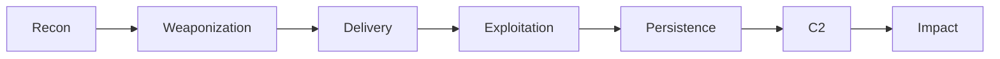
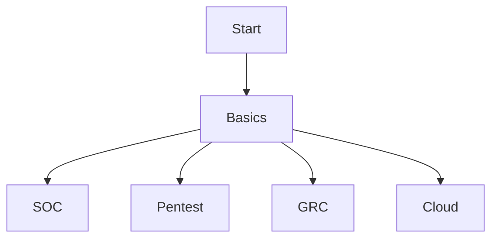

# 🛡️ The Zero-to-Hero Cybersecurity Handbook

**A structured, practical, zero-to-hero roadmap to learning Cybersecurity — without confusion, fluff, or hype.**

🚀 Built for **students, beginners, and career switchers**  
🧠 Learn **how attackers think & how defenders respond**

[Start Learning](#-phase-1-the-foundations) • [Career Map](#-career-navigator) • [Practice Labs](#-the-dojo-practice-platforms) • [Contribute](#-how-to-contribute)

---

## ❓ Why This Handbook Exists

Most beginners fail in cybersecurity because:
- ❌ They jump into tools without fundamentals  
- ❌ They follow random YouTube playlists  
- ❌ They don’t understand *why* things work  

This handbook fixes that by teaching:
- **Foundations → Attacks → Defense → Specialization**
- Concepts **before** tools
- Practice **with intent**

---

# 🧠 Phase 1: The Foundations (NON-NEGOTIABLE)

> ⚠️ If you skip this phase, everything later will feel hard and confusing.

---

## 🔺 CIA Triad & Beyond

| Pillar | Meaning | Real-World Example |
|---|---|---|
| **Confidentiality** | Data is visible only to authorized users | HR salary leak |
| **Integrity** | Data cannot be altered secretly | Bank transaction manipulation |
| **Availability** | Systems remain accessible | DDoS during sale |
| **Authenticity** | Identity is verifiable | Signed software updates |
| **Non-Repudiation** | Actions cannot be denied | Email with digital signature |

📘 Learn More:
- https://www.cisa.gov/what-cybersecurity
- https://www.nist.gov/cyberframework

---

## 🔐 AAA — Identity & Access Management (IAM)

- **Authentication** → Who are you?
- **Authorization** → What can you do?
- **Accounting** → What did you do?

🧠 Beginner Tip:  
> If you don’t understand **IAM**, you won’t understand **cloud security, SOC alerts, or breaches**.

📘 Learn:
- https://learn.microsoft.com/en-us/security/zero-trust/identity-access
- https://auth0.com/docs

---

## 🌐 Core Technical Foundations (MANDATORY)

Before hacking, you **must** understand:

| Topic | Why It Matters |
|---|---|
| Networking | Attacks move over networks |
| Operating Systems | Malware lives here |
| Linux | Security tooling runs here |
| Scripting | Automation & understanding exploits |

📚 Learn Here:
- Networking: https://www.youtube.com/@PracticalNetworking
- Linux: https://linuxjourney.com
- Python: https://automatetheboringstuff.com

---

# 🦠 Phase 2: The Attack Lifecycle (How Attacks REALLY Work)

## 🧠 Golden Rule

> **You cannot defend what you don’t understand.**

---

## 🛡️ Cyber Kill Chain — Beginner View

| Stage | Attacker Action | Defender Focus |
|---|---|---|
| Recon | OSINT, scanning | Reduce exposure |
| Delivery | Phishing, USB | Email security |
| Exploit | CVE abuse | Patch management |
| Persistence | Backdoors | EDR |
| C2 | Beaconing | DNS & firewall |
| Impact | Data theft | IR & backups |

### 📘 Learn
- 🔗 https://attack.mitre.org
- 🔗 https://www.lockheedmartin.com/en-us/capabilities/cyber/cyber-kill-chain.html

---

## 🛡️ Phase 3: Defensive Engineering (Blue Team)

> **Blue Team = Detection, Response, Recovery**

---

### 🏛 Core Frameworks (READ THESE)

| Framework | Why It Matters |
|---|---|
| **NIST CSF** | Industry standard |
| **MITRE ATT&CK** | Maps real attacks |
| **Zero Trust** | Modern security model |

### 📘 Official Learning
- 🔗 https://www.nist.gov/cyberframework
- 🔗 https://attack.mitre.org
- 🔗 https://zerotrust.microsoft.com

---

### 🧰 Defensive Stack Explained Simply

| Tool | What It Does |
|---|---|
| **SIEM** | Collects & correlates logs |
| **EDR** | Detects endpoint threats |
| **SOAR** | Automates response |
| **Firewall** | Controls traffic |
| **Threat Intelligence** | Knows the enemy |

### 🧪 Practice
- 🔗 https://tryhackme.com/path/outline/soclevel1
- 🔗 https://blueteamlabs.online

---

## ⚔️ Phase 4: Offensive Operations (Red Team)

> **Red Teamers think like attackers — not script kiddies.**

| Type | Focus |
|---|---|
| **Vulnerability Scan** | What is weak |
| **Pentest** | What can be exploited |
| **Red Team** | Can we stay undetected |

### 📘 Learn
- 🔗 https://portswigger.net/web-security
- 🔗 https://academy.hackthebox.com

---

## 🌐 Phase 5: Advanced Domains

---

### ☁️ Cloud Security

- Shared Responsibility Model
- IAM Misconfigurations (**BIGGEST RISK**)
- Logging & monitoring

#### 📘 Learn
- 🔗 https://learn.microsoft.com/security
- 🔗 https://aws.amazon.com/security

---

### 💻 Application Security

- OWASP Top 10
- Secure coding practices
- CI/CD security

#### 📘 Learn
- 🔗 https://owasp.org/www-project-top-ten
- 🔗 https://portswigger.net

---

## 🗺 Career Navigator (REALISTIC PATHS)

## 💡 Beginner Advice

> **Start with SOC or Blue Team → then specialize.**

---

## 🏅 Certifications (WHEN READY)

| Certification | Level |
|---|---|
| **Security+** | Beginner |
| **eJPT** | Beginner |
| **GCIH** | Intermediate |
| **OSCP** | Advanced |
| **CISSP** | Senior |

⚠️ **Do skills first, certifications later.**

---

## 🥋 The Dojo: Practice Platforms

| Platform | Focus |
|---|---|
| **TryHackMe** | Guided learning |
| **Hack The Box** | Realistic labs |
| **PortSwigger Academy** | Web security |
| **LetsDefend** | SOC training |
| **OverTheWire** | Linux basics |

---

## 🧠 How to Study Cybersecurity (IMPORTANT)

### ✅ Do This
- Learn concepts
- Practice immediately
- Write notes
- Break things
- Fix them

### ❌ Avoid This
- Memorizing tools
- Rushing certifications

---

## ⚖️ Legal & Ethics

🚨 **Only test systems you own or have explicit permission for.**  
Cybersecurity without ethics = **crime**.

---

## 🤝 How to Contribute

- Add learning resources
- Improve explanations
- Add beginner labs
- Fix errors

---

⭐ **Star → Fork → Learn → Teach Others** ⭐  
**This handbook grows with the community.**

